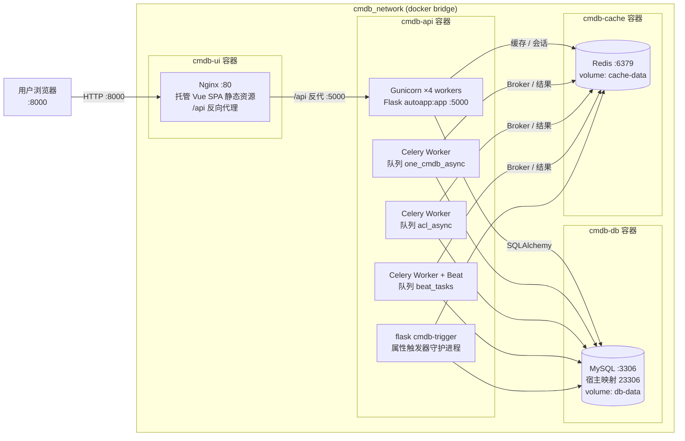
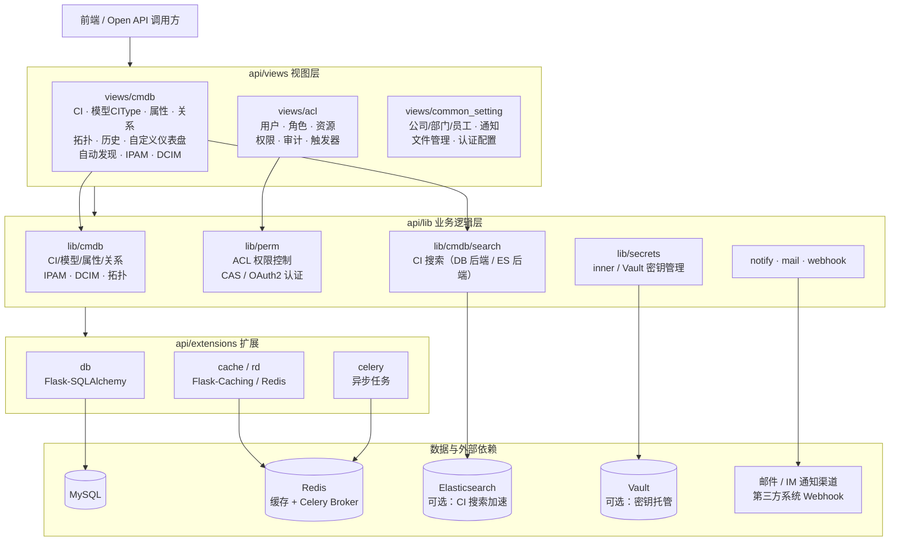

# 维易 CMDB 架构图

## 部署视图（Docker Compose）

## 后端内部模块视图（cmdb-api）

## 说明

- **cmdb-ui**：Nginx 托管 Vue.js + Ant Design Vue 单页应用，`/api` 请求反向代理到后端（见 `docs/nginx.cmdb.conf.example`）。
- **cmdb-api**：单容器内运行 Gunicorn Web 进程、3 组 Celery 队列（`one_cmdb_async`、`acl_async`、`beat_tasks` 含定时调度）和属性触发器守护进程（见 `docker-compose.yml` 启动命令）。
- **cmdb-db**：MySQL 存储全部模型与实例数据，首次启动由 `docs/cmdb.sql` 初始化。
- **cmdb-cache**：Redis 同时承担应用缓存与 Celery 消息队列。
- **可选依赖**：Elasticsearch（`settings.py` 中配置后用于 CI 全文搜索）、Vault（密钥管理）、邮件/Webhook 通知。
- **自动发现**：内置模板（如 `api/lib/cmdb/auto_discovery/templates/aws_ec2.json`），支持主机、网络设备、数据库、中间件、公有云资源采集入库。
